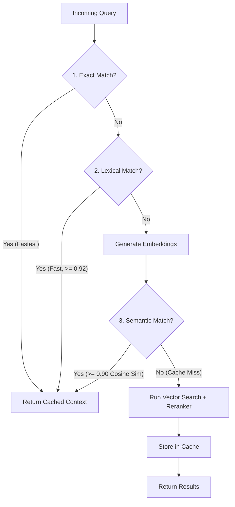

# Semantic Retrieval Caching in Relanto Policies RAG

This directory contains documentation and architecture guidelines for the in-memory **Semantic Retrieval Cache** implemented inside the [retrieval](file:///c:/Users/Relanto/Relanto-Policies-RAG/retrieval) module (specifically in [cache.py](file:///c:/Users/Relanto/Relanto-Policies-RAG/retrieval/cache.py)).

---

## 🚀 How the Cache Works Today

The semantic cache avoids costly embedding generation and database queries by checking the similarity of incoming user queries against already retrieved query-context pairs during an active chat session.

It performs a three-tiered lookup strategy:

1. **Exact Match (No-Embed Cost):** Converts the query to lowercase and removes punctuation. If the normalized tokens match a cached query exactly, it reuses the results instantly.
2. **Lexical Match (No-Embed Cost):** Measures string similarity using `difflib.SequenceMatcher` and token overlap ratio. If similarity is $\ge 0.92$ (default threshold), the cached context is returned.
3. **Semantic Match (BGE Cosine Similarity):** If both quick checks fail, it embeds the query and computes cosine similarity against cached query vectors. If similarity is $\ge 0.90$, it reuses the cached context.

---

## 🛠️ Next Steps & What Needs to be Done

To transition from an in-memory session cache to a production-grade enterprise caching layer, the following tasks are planned or need attention:

### 1. Persistent Caching Layer
* **Problem:** The current cache is in-memory and bound to the single active process/session. If the server restarts or a new user joins, the cache starts empty.
* **To Do:** 
  - Integrate a persistent database store (e.g., **Redis** or a schema table in the **Neon/Postgres** database) to persist cache entries across restarts and share cache hits among multiple users.

### 2. Cache Invalidation Engine
* **Problem:** If a policy document is updated or a new PDF is ingested, the cached parent chunks are outdated but will still be returned on high-confidence cache hits.
* **To Do:**
  - Implement a webhook or trigger that clears the cache (or specific entries matching the modified document) when `ingestion/pipeline.py index` is run.

### 3. Streamlit Session Binding
* **Problem:** Need to ensure the cache stays active and correctly aligned per-user in Streamlit.
* **To Do:**
  - Instantiate `SemanticRetrievalCache` inside Streamlit’s `st.session_state` in [frontend/app.py](file:///c:/Users/Relanto/Relanto-Policies-RAG/frontend/app.py) to prevent cross-session leakage.

### 4. Dynamic Threshold Optimization
* **Problem:** Hardcoded thresholds ($0.92$ lexical and $0.90$ semantic) may be too aggressive or permissive depending on user behavior.
* **To Do:**
  - Expose these thresholds via environment variables (`LEXICAL_CACHE_THRESHOLD`, `SEMANTIC_CACHE_THRESHOLD`) and add telemetry tracking to calculate Cache Hit Rates and precision.
